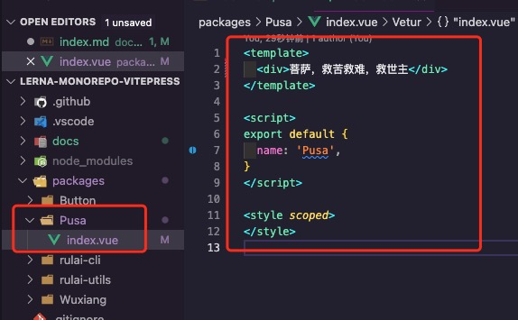
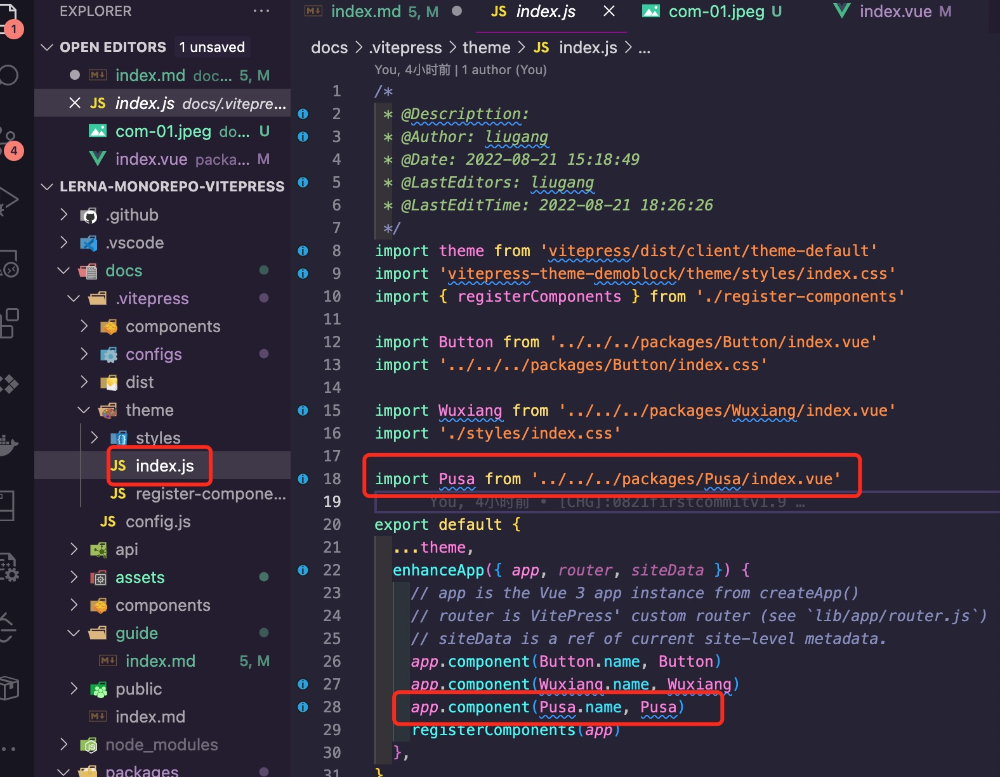
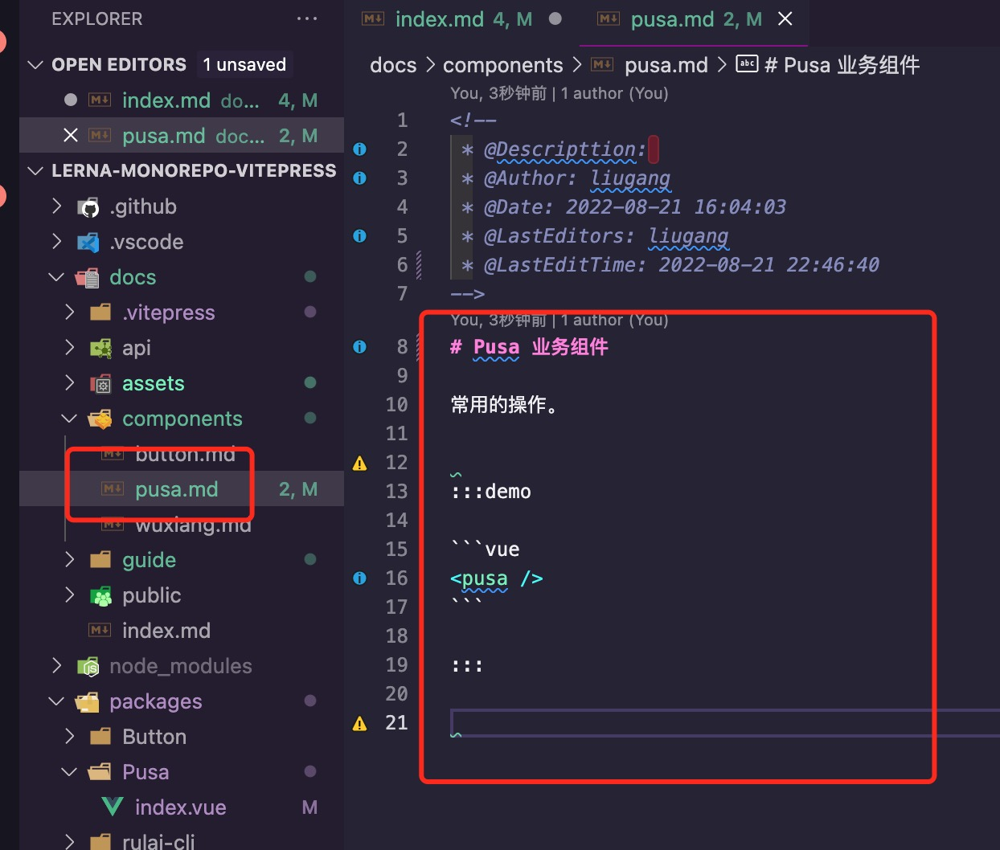

# guide

组件发布指南

### 第一步 创建组件
在packages 下面创建 需要发布的组件，比如：pusa组件



```vue
<template>
  <div>菩萨，救苦救难，救世主</div>
</template>

<script>
export default {
  name: 'Pusa',
}
</script>

<style scoped>
</style>
```

### 第二步 在docs下面注册组件

目标路径  docs/.vitepress/theme/index.js  下面注册pusa组件



```javascript
...
import Pusa from '../../../packages/Pusa/index.vue'
...
export default {
  ...
  enhanceApp({ app, router, siteData }) {
    ...
    app.component(Pusa.name, Pusa)
    ...
  },
```

### 第三步 在components 下面创建pusa.md文件



####  Pusa 业务组件

常用的操作。


:::demo

```vue
<pusa />
```

:::
